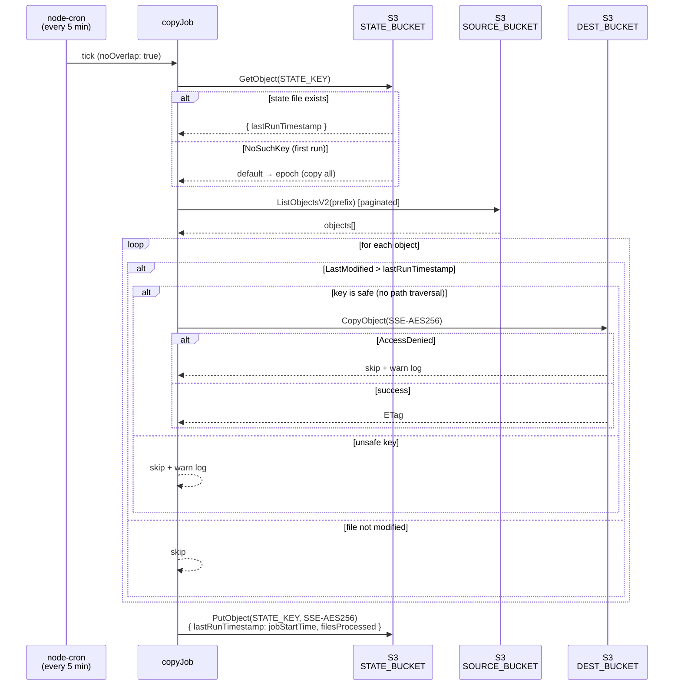

# s3-sync-cron

A Node.js/TypeScript Docker service that copies files from one AWS S3 bucket to another on a configurable cron schedule. Only files whose `LastModified` timestamp is newer than the last recorded run are copied — state is persisted in S3 so the service is fully stateless and survives container restarts.

## Features

- **Time-based sync** — compares each object's `LastModified` against a persisted last-run timestamp
- **S3 state persistence** — stores a small JSON state file in S3; no local disk required
- **Paginated listing** — handles buckets with any number of objects via `ListObjectsV2` continuation tokens
- **Graceful shutdown** — catches `SIGTERM`/`SIGINT`, waits for the in-flight job to finish (configurable timeout), then exits cleanly
- **No-overlap protection** — `node-cron` `noOverlap: true` prevents concurrent runs if a tick takes longer than the interval
- **Structured JSON logging** — `pino` with credential redaction
- **Secure by default** — SSE-S3 encryption on all writes, key-name validation, least-privilege IAM, non-root container user

## Quick start

```bash
# 1. Copy the env template and fill in your values
cp .env.example .env

# 2. Install dependencies
npm ci

# 3. Run in watch mode (development)
npm run dev
```

## Environment variables

| Variable | Required | Default | Description |
|---|---|---|---|
| `AWS_REGION` | ✅ | — | AWS region |
| `AWS_ACCESS_KEY_ID` | ✅ | — | IAM access key (use an IAM role in production) |
| `AWS_SECRET_ACCESS_KEY` | ✅ | — | IAM secret key |
| `SOURCE_BUCKET` | ✅ | — | Bucket to read files from |
| `SOURCE_PREFIX` | | `""` | Key prefix (folder) within the source bucket |
| `DEST_BUCKET` | ✅ | — | Bucket to copy files to |
| `DEST_PREFIX` | | `""` | Key prefix (folder) within the destination bucket |
| `STATE_BUCKET` | ✅ | — | Bucket used to store the state JSON file |
| `STATE_KEY` | | `s3-sync-cron/state.json` | S3 key for the state file |
| `CRON_SCHEDULE` | | `*/5 * * * *` | cron expression for the sync interval |
| `LOG_LEVEL` | | `info` | `trace` / `debug` / `info` / `warn` / `error` / `fatal` |
| `SHUTDOWN_TIMEOUT_MS` | | `10000` | Max ms to wait for in-flight job on SIGTERM |

## npm scripts

| Script | Description |
|---|---|
| `npm run build` | Compile TypeScript to `dist/` |
| `npm start` | Run compiled output |
| `npm run dev` | Run with hot-reload via `tsx watch` |
| `npm run typecheck` | Type-check without emitting |
| `npm test` | Run all tests once |
| `npm run test:watch` | Run tests in watch mode |
| `npm run test:coverage` | Run tests with V8 coverage report |

## Docker

```bash
# Build
docker build -t s3-sync-cron .

# Run (hardened flags)
docker run \
  --env-file .env \
  --cap-drop ALL \
  --read-only \
  --tmpfs /tmp \
  s3-sync-cron
```

The image uses a multi-stage build (`node:20-alpine`) and runs as a non-root user (UID 1001).

## Project structure

```
src/
  index.ts          Entry point — cron schedule, signal handlers, graceful shutdown
  config.ts         Loads and validates env vars via Zod (only place process.env is read)
  configSchema.ts   Exported Zod schema + Config type (also used in tests)
  logger.ts         pino logger with credential redaction
  types.ts          SyncState, CopyResult interfaces
  s3Client.ts       S3Client singleton (maxAttempts: 3)
  stateManager.ts   readState() / writeState() — S3 JSON state file
  copyJob.ts        runCopyJob() — list → filter → copy → write state
  __tests__/
    config.test.ts        Zod schema validation (20 assertions)
    stateManager.test.ts  readState / writeState with mocked S3
    copyJob.test.ts       Core sync logic, pagination, error handling
```

## How it works



On the first run (no state file), `lastRunTimestamp` defaults to the Unix epoch so all existing objects are copied.

## Security

| Layer | Control |
|---|---|
| Credentials | Env vars only; redacted in all log output |
| IAM | Least-privilege — no `s3:DeleteObject`, no wildcards (see [INFRA.md](INFRA.md)) |
| Transport | HTTPS enforced by AWS SDK v3 |
| Encryption at rest | SSE-S3 (`AES256`) on every `PutObject` / `CopyObject` |
| Input validation | S3 key names validated (path-traversal `../` rejected) |
| Container | Non-root UID 1001; `--cap-drop ALL`; read-only root filesystem |
| Dependencies | `package-lock.json` committed; `npm audit` — 0 vulnerabilities |

See [INFRA.md](INFRA.md) for the full IAM policy JSON, deployment guides (ECS / Kubernetes), and monitoring setup.

## License

MIT
