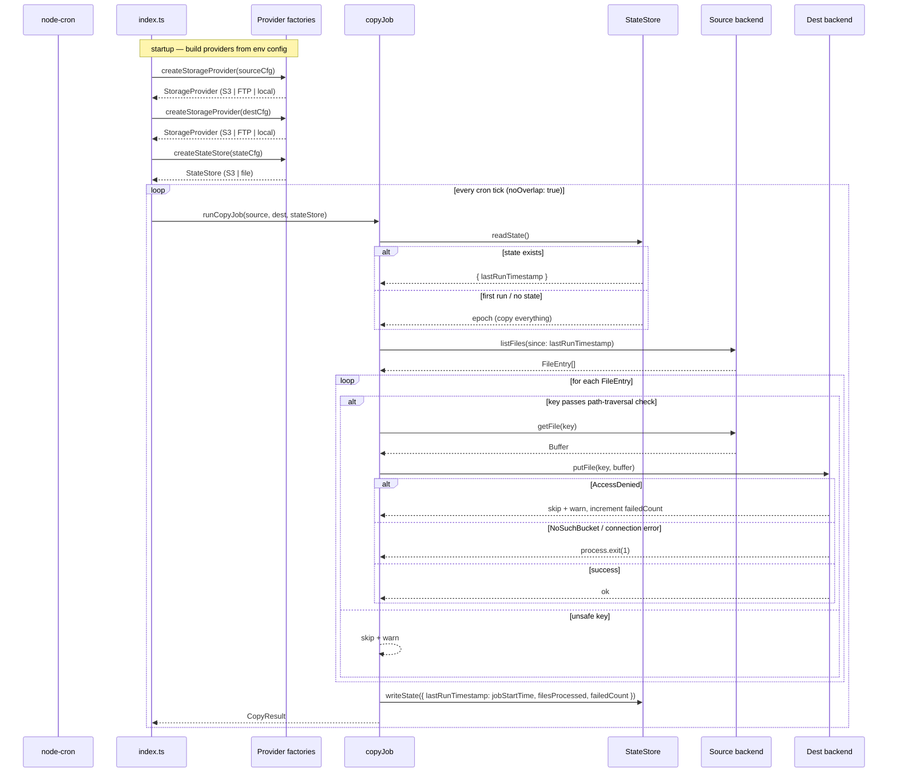

# storage-sync-cron

A Node.js/TypeScript Docker service that syncs files between configurable storage backends on a cron schedule. Only files modified after the last recorded run are transferred — state is persisted so the service survives container restarts.

Supported backends: **AWS S3**, **FTP/FTPS**, and **local filesystem folders**. Any combination works: S3→S3, FTP→S3, local→S3, S3→local, local→local, etc.

## Features

- **Multi-backend sync** — source and destination are independently configured as S3, FTP, or local folder
- **Time-based filtering** — compares each file's `LastModified` against a persisted last-run timestamp
- **Flexible state storage** — sync state can be kept in S3 or a local JSON file
- **Provider Pattern** — new backends register themselves; no changes needed in core sync logic
- **Paginated listing** — handles buckets/directories with any number of objects
- **Graceful shutdown** — catches `SIGTERM`/`SIGINT`, waits for the in-flight job to finish (configurable timeout), then exits cleanly
- **No-overlap protection** — `node-cron` `noOverlap: true` prevents concurrent runs if a tick takes longer than the interval
- **Structured JSON logging** — `pino` with credential redaction
- **Secure by default** — SSE-S3 encryption on S3 writes, key-name path-traversal validation, non-root container user

## Quick start

```bash
# 1. Copy the env template and fill in your values
cp .env.example .env

# 2. Install dependencies
npm ci

# 3. Run in watch mode (development)
npm run dev
```

## Environment variables

### Common

| Variable | Required | Default | Description |
|---|---|---|---|
| `SOURCE_TYPE` | | `s3` | Source backend: `s3`, `ftp`, or `local` |
| `DEST_TYPE` | | `s3` | Destination backend: `s3`, `ftp`, or `local` |
| `STATE_TYPE` | | `s3` | State store backend: `s3` or `file` |
| `CRON_SCHEDULE` | | `*/5 * * * *` | cron expression for the sync interval |
| `LOG_LEVEL` | | `info` | `trace` / `debug` / `info` / `warn` / `error` / `fatal` |
| `SHUTDOWN_TIMEOUT_MS` | | `10000` | Max ms to wait for in-flight job on SIGTERM |

### S3 shared credentials (fallback for all S3 configs)

| Variable | Required | Description |
|---|---|---|
| `AWS_REGION` | ✅ (if any S3) | AWS region |
| `AWS_ACCESS_KEY_ID` | ✅ (if any S3) | IAM access key |
| `AWS_SECRET_ACCESS_KEY` | ✅ (if any S3) | IAM secret key |

### S3 source (`SOURCE_TYPE=s3`)

| Variable | Required | Default | Description |
|---|---|---|---|
| `SOURCE_S3_BUCKET` | ✅ | — | Source bucket (legacy: `SOURCE_BUCKET`) |
| `SOURCE_S3_PREFIX` | | `""` | Key prefix within the bucket (legacy: `SOURCE_PREFIX`) |
| `SOURCE_S3_REGION` | | `AWS_REGION` | Override region for source |
| `SOURCE_S3_ACCESS_KEY_ID` | | `AWS_ACCESS_KEY_ID` | Override credentials for source |
| `SOURCE_S3_SECRET_ACCESS_KEY` | | `AWS_SECRET_ACCESS_KEY` | |

### S3 destination (`DEST_TYPE=s3`)

| Variable | Required | Default | Description |
|---|---|---|---|
| `DEST_S3_BUCKET` | ✅ | — | Destination bucket (legacy: `DEST_BUCKET`) |
| `DEST_S3_PREFIX` | | `""` | Key prefix within the bucket (legacy: `DEST_PREFIX`) |
| `DEST_S3_REGION` | | `AWS_REGION` | Override region for destination |
| `DEST_S3_ACCESS_KEY_ID` | | `AWS_ACCESS_KEY_ID` | Override credentials for destination |
| `DEST_S3_SECRET_ACCESS_KEY` | | `AWS_SECRET_ACCESS_KEY` | |

### FTP source (`SOURCE_TYPE=ftp`)

| Variable | Required | Default | Description |
|---|---|---|---|
| `SOURCE_FTP_HOST` | ✅ | — | FTP server hostname |
| `SOURCE_FTP_USER` | ✅ | — | FTP username |
| `SOURCE_FTP_PASSWORD` | ✅ | — | FTP password |
| `SOURCE_FTP_PORT` | | `21` | FTP port |
| `SOURCE_FTP_BASE_PATH` | | `/` | Root directory on the FTP server |
| `SOURCE_FTP_SECURE` | | `false` | Enable explicit FTPS (AUTH TLS) |

### FTP destination (`DEST_TYPE=ftp`)

Same variables as FTP source with `DEST_` prefix.

### Local folder source (`SOURCE_TYPE=local`)

| Variable | Required | Default | Description |
|---|---|---|---|
| `SOURCE_LOCAL_PATH` | ✅ | — | Absolute or relative path to the source directory |

### Local folder destination (`DEST_TYPE=local`)

| Variable | Required | Default | Description |
|---|---|---|---|
| `DEST_LOCAL_PATH` | ✅ | — | Absolute or relative path to the destination directory |

### S3 state store (`STATE_TYPE=s3`)

| Variable | Required | Default | Description |
|---|---|---|---|
| `STATE_S3_BUCKET` | ✅ | — | Bucket for the state file (legacy: `STATE_BUCKET`) |
| `STATE_S3_KEY` | | `s3-sync-cron/state.json` | Object key for the state file (legacy: `STATE_KEY`) |
| `STATE_S3_REGION` | | `AWS_REGION` | |
| `STATE_S3_ACCESS_KEY_ID` | | `AWS_ACCESS_KEY_ID` | |
| `STATE_S3_SECRET_ACCESS_KEY` | | `AWS_SECRET_ACCESS_KEY` | |

### File state store (`STATE_TYPE=file`)

| Variable | Required | Default | Description |
|---|---|---|---|
| `STATE_FILE_PATH` | | `./sync-state.json` | Local path for the state JSON file |

## Example configurations

**S3 → S3** (original behaviour, legacy env vars still work):
```env
SOURCE_BUCKET=my-source
DEST_BUCKET=my-dest
STATE_BUCKET=my-state
AWS_REGION=us-east-1
AWS_ACCESS_KEY_ID=...
AWS_SECRET_ACCESS_KEY=...
```

**FTP → S3**:
```env
SOURCE_TYPE=ftp
SOURCE_FTP_HOST=ftp.example.com
SOURCE_FTP_USER=user
SOURCE_FTP_PASSWORD=secret
SOURCE_FTP_BASE_PATH=/uploads

DEST_TYPE=s3
DEST_S3_BUCKET=my-dest
AWS_REGION=us-east-1
AWS_ACCESS_KEY_ID=...
AWS_SECRET_ACCESS_KEY=...

STATE_TYPE=file
STATE_FILE_PATH=./sync-state.json
```

**S3 → FTP**:
```env
SOURCE_TYPE=s3
SOURCE_S3_BUCKET=my-source
AWS_REGION=us-east-1
AWS_ACCESS_KEY_ID=...
AWS_SECRET_ACCESS_KEY=...

DEST_TYPE=ftp
DEST_FTP_HOST=ftp.example.com
DEST_FTP_USER=user
DEST_FTP_PASSWORD=secret
DEST_FTP_BASE_PATH=/processed
```

**local folder → local folder**:
```env
SOURCE_TYPE=local
SOURCE_LOCAL_PATH=/mnt/data/incoming

DEST_TYPE=local
DEST_LOCAL_PATH=/mnt/data/processed

STATE_TYPE=file
STATE_FILE_PATH=./sync-state.json
```

## npm scripts

| Script | Description |
|---|---|
| `npm run build` | Compile TypeScript to `dist/` |
| `npm start` | Run compiled output |
| `npm run dev` | Run with hot-reload via `tsx watch` |
| `npm run typecheck` | Type-check without emitting |
| `npm test` | Run all tests once |
| `npm run test:watch` | Run tests in watch mode |
| `npm run test:coverage` | Run tests with V8 coverage report |

## Docker

```bash
# Build
docker build -t s3-sync-cron .

# Run (hardened flags)
docker run \
  --env-file .env \
  --cap-drop ALL \
  --read-only \
  --tmpfs /tmp \
  s3-sync-cron
```

The image uses a multi-stage build (`node:20-alpine`) and runs as a non-root user (UID 1001).

## Project structure

```
src/
  index.ts          Entry point — cron schedule, signal handlers, graceful shutdown
  config.ts         Loads env vars via lookup maps (one entry per backend type)
  configSchema.ts   Zod schema with discriminated unions for source/dest/state
  logger.ts         pino logger with credential redaction
  types.ts          FileEntry, StorageProvider, StateStore, SyncState, CopyResult
  stateManager.ts   StateStoreFactory registry — createStateStore(cfg)
  copyJob.ts        runCopyJob(source, dest, stateStore) — list → filter → transfer → persist
  providers/
    storageProviderFactory.ts   StorageProviderFactory registry — createStorageProvider(cfg)
    s3Provider.ts               S3StorageProvider
    ftpProvider.ts              FtpStorageProvider (basic-ftp)
    localProvider.ts            LocalStorageProvider (fs/promises)
  stateStore/
    s3StateStore.ts             S3StateStore
    fileStateStore.ts           FileStateStore (fs/promises)
  schemas/
    index.ts                    Re-exports all schemas + types
    s3ProviderSchema.ts         Zod schema for S3 provider
    ftpProviderSchema.ts        Zod schema for FTP provider
    localProviderSchema.ts      Zod schema for local folder provider
    s3StateSchema.ts            Zod schema for S3 state store
    fileStateSchema.ts          Zod schema for file state store
  __tests__/
    config.test.ts              Schema validation incl. FTP + file-state combinations
    stateManager.test.ts        S3StateStore and FileStateStore with mocks
    copyJob.test.ts             Core sync logic via mock StorageProvider / StateStore
    localProvider.test.ts       LocalStorageProvider with mocked fs/promises
```

## How it works



## Security

| Layer | Control |
|---|---|
| Credentials | Env vars only; redacted in all log output |
| IAM | Least-privilege — no `s3:DeleteObject`, no wildcards (see [INFRA.md](INFRA.md)) |
| Transport | HTTPS enforced by AWS SDK v3; FTPS supported via `SOURCE_FTP_SECURE=true` |
| Encryption at rest | SSE-S3 (`AES256`) on every S3 `PutObject` |
| Input validation | File keys validated (path-traversal `../` rejected) |
| Container | Non-root UID 1001; `--cap-drop ALL`; read-only root filesystem |
| Dependencies | `package-lock.json` committed; `npm audit` — 0 vulnerabilities |

See [INFRA.md](INFRA.md) for the full IAM policy JSON, deployment guides (ECS / Kubernetes), and monitoring setup.

## License

MIT

